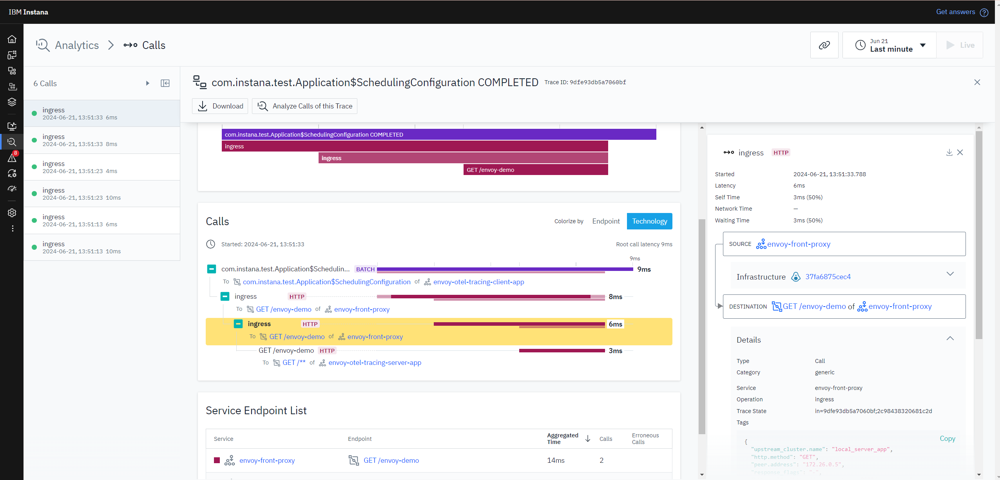

# Envoy Proxy: Instana OTel Tracing Demo

This repository demonstrates Instana's [Envoy Proxy](https://www.envoyproxy.io/) tracing functionality
based on [OpenTelemetry](https://opentelemetry.io/docs/languages/cpp/).

The OTel traces are sent to the Instana agent OpenTelemetry plugin via gRPC to port 4317.
It has to
[be enabled](https://www.ibm.com/docs/en/instana-observability/current?topic=opentelemetry-sending-data-instana-agent)
for this. This is the only supported scenario for now.

## Supported Versions

Envoy Proxy versions 1.30 until latest are supported by the distributed tracing based on OpenTelemetry.

For Envoy Proxy versions 1.15 until 1.29 use the old demonstration repository
[envoy-tracing](https://github.com/instana/envoy-tracing) based on OpenTracing.

## Prerequisites

A `docker-compose` installation running on your machine.

## Configure

Create a `.env` file in the root of the checked-out version of this repository and enter the following content.
The values need to be adjusted to your environment.

```text
agent_key=<agent secret key>
download_key=<download secret key (optional agent key with download privileges)>
agent_zone=<name of the zone for the agent; default: envoy-tracing-demo>
agent_endpoint=<local ip or remote host; e.g. ingress-red-saas.instana.io>
agent_endpoint_port=<443 already set as default; or 4443 for local>
```

In most scenarios only the field `agent_key` and `agent_endpoint` are required.

A template [.env.template](.env.template) can be copied to `.env` for your convenience.

## Build & Launch

```bash
docker-compose up --build
```

This will build and launch the following components:
- `client-app` service, a simple Spring Boot application that issues a request every second to the ...
- `envoy` service, which routes all incoming requests to the ...
- `server-app` service, a simple Spring Boot application that returns `200` to any HTTP request.

After the agent is bootstrapped and starts accepting spans from Envoy, the resulting traces in the Analyze view will
look like this:


