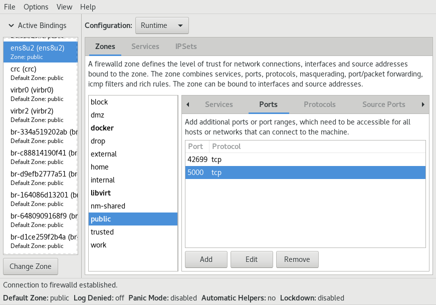

## Run Envoy Proxy OTel tracing demo in Minikube

This demo part is based on minikube, QEMU/KVM, `kubectl`, helm 3, Docker CE,
RHEL 8, `firewall-config`, shell command `envstubst` (`gettext` package),
and the Docker registry image `registry:2`.

RHEL 8 is only used as an example OS here. Most parts work pretty much the
same on other Linux distributions as well.

The Bash script to run this demo is `mk.sh`.

Common usage:
```
cd minikube
./mk.sh --up     # start minikube KVM VM, build and run the full demo
./mk.sh --demo-down   # keep Instana agent running, stop the rest
# modify something
./mk.sh --up     # bring up the demo again
./mk.sh --down   # stop and remove the full demo including Instana agent from K8s
./mk.sh --stop   # delete minikube VM completely
```

### Implementation details

The Bash script `mk.sh` tries to emulate `docker-compose` behavior.
This is why `./mk.sh --up` builds the Docker images of the client-app,
the server-app and Envoy Proxy with `docker-compose build` first.
Then it pushes those images to a local insecure Docker registry called
`myregistry` whose IP needs to be added to `/etc/hosts` on a Linux system.
The script starts `minikube` and deploys the client-app, the server-app,
the Instana agent, and Envoy Proxy.
The `helm` command in version 3 is required to deploy the Instana agent.

### Envoy Proxy endpoint address

In `../envoy/envoy-gateway.yaml` OpenTelemetry plugin configuration it
is impossible to set the endpoint address hostname from an environment
variable.

Also the hostname `instana-agent` is not reachable there, because this demo
is running in a different namespace `envoy-demo`. To reach a different
namespace, "hostname.namespace" has to be used in Kubernetes.

So the `mk.sh` script uses `envsubst` to replace shell variable
`INSTANA_AGENT_HOST` in `../envoy/envoy-gateway.yaml.in` with
`instana-agent.instana-agent`. The resulting config file is
`../envoy/envoy-gateway.yaml`.
That one is deployed by calling `docker-compose build` right after.

### Install minikube on RHEL 8

Just follow a howto:

https://www.linuxtechi.com/install-minikube-on-rhel-rockylinux-almalinux/

### Install helm 3 on RHEL 8

Follow a howto:

https://kubernetes.recipes/recipes/helm/install-helm-rhel/

### Run the Docker registry

Ensure the current system has a static IP address (set static DHCP config in router).

Add a line with the external Ethernet IP address of your system to `/etc/hosts`:
```
# Example with IP 192.168.0.2:
sudo bash -c 'echo "192.168.0.2   myregisty" >> /etc/hosts'
```

The `mk.sh` script gathers automatically the IP address of the `myregistry`
this way and uses it to generate the resulting minikube YAML files, such as
`client-app-deployment.yaml`.

Open port TCP 5000 in local network firewall config.

Example on RHEL 8:
```
firewall-config
# find the zone of your Ethernet interface, open TCP port 5000 on that zone
# select "Options" -> "Runtime To Permanent" to save this permanently
```



Run the Docker registry:
```
sudo mkdir -p /srv/registry/data
docker run -d -p 5000:5000 --name registry -v /srv/registry/data:/var/lib/registry --restart always registry:2
```

The Docker registry is restarted upon system reboot.
